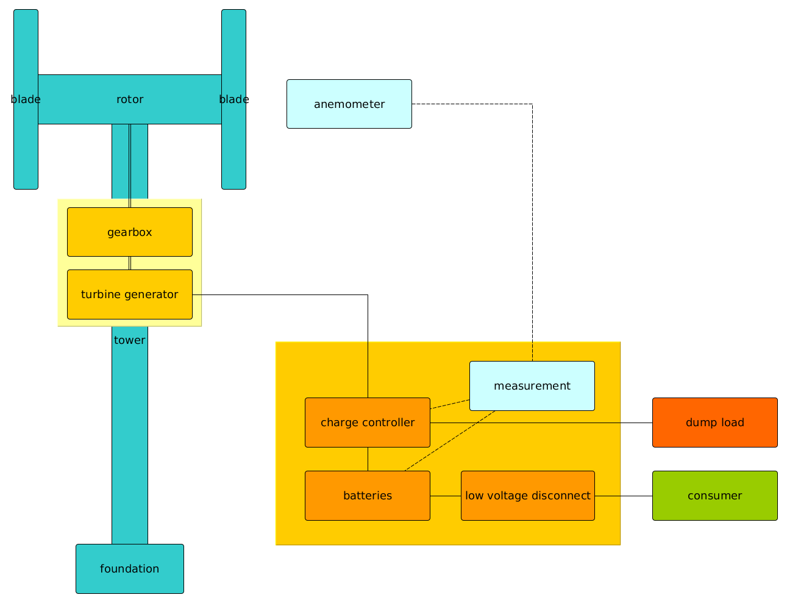

Eddy2Power
==========

This repository contains circuits, pictures, formulas and source code for a
small vertical wind turbine. The main design goals are low tech and easy to
build with widespread tools. Most parts and materials are swappable with what
you can find at your place.

You can read all the documentation here:
https://systemausfall.org/wikis/howto/Eddy-2-Power (mostly German atm)

# Design goals
 * low tech materials
 * modular construction
 * customizable parts
 * open source plans

# License
 * The default license for code is GNU GPL v3.0
 * Circuits and Hardware designs are under TAPR Open Hardware License v1.0
